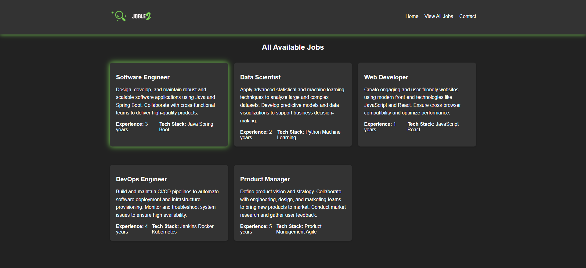

# JobLe2 - My Job Portal Learning Project

<div align="center">
  <a href="https://github.com/AnirudhHanda/JobLe2---JSP/tree/main">
    

  </a>
</div>
This is a simple Java Spring Boot web application I built to learn more about web development and practice using Spring Boot, JSP, and JSTL. It's a basic job portal where users can post and view job listings.

## Features


* User-friendly interface (still a work in progress!)
* Basic job posting and viewing functionality
* Dark theme for a cool look

## Screenshots

* Home Page
<div align="center">
  
</div>

* Job Posting Form

<div align="center">
  
</div>

* Job Listings Page

<div align="center">
  
</div>

* Success Page

<div align="center">
  
</div>

## Technologies Used

* Java
* Spring Boot
* JSP (JavaServer Pages)
* JSTL (JavaServer Pages Standard Tag Library)
* HTML
* CSS

## Getting Started

### Prerequisites

* Java JDK 17 or above:  Make sure you have a compatible Java Development Kit installed. You can download it from the [official Oracle website](https://www.oracle.com/java/technologies/javase/jdk.html) or use a package manager like `sdkman`.

### Running the Application

#### 1. Using an IDE (Recommended)

If you're using IntelliJ IDEA or Eclipse:

1. Clone the repository:
   ```bash
   git clone https://github.com/AnirudhHanda/JobLe2---JSP.git 
   ```

   If you're using IntelliJ IDEA or Eclipse:

   1.  **Open the project in your IDE:**
      *   IntelliJ IDEA: `File -> Open` and select the cloned project folder.
      *   Eclipse: `File -> Import -> Existing Maven Projects` and select the cloned project folder.

   2.  **Run the application:**
      *   Locate the `O197jobLe2Application.java` file.
      *   Right-click on it and choose "Run 'App.java'" or a similar option.

   3.  **Access the application:**
      *   Once the application starts, open your web browser and go to `http://localhost:8080`.

#### 2. Using Maven (For VS Code or Command Line)

If you prefer using VS Code or the command line, you'll need Maven installed:

1. **Install Maven:**
   * Download and install Maven from the [official Apache Maven website](https://maven.apache.org/download.cgi).
   * Make sure the `mvn` command is available in your terminal or command prompt.

2. **Clone the repository:**

   ```bash
   git clonehttps://github.com/AnirudhHanda/JobLe2---JSP.git
   ```
   
   
3.  **Navigate to the project directory:**
   *  ``` Bash
       cd o197JobLe2  # Replace 'o197joble2' with your actual project folder name.

4.  **Build and run the application:**
   *  ```bash
      ./mvnw spring-boot:run 

5.  **Access the application:**
   *   Once the application starts, open your web browser and go to `http://localhost:8080`.

### Running the Application
Feel free to contribute if you have any ideas or improvements!

### License
This project is licensed under the MIT License.
